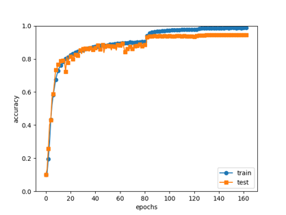

# CNN Models
This repository compares CNN models (LeNet, AlexNet, VGGNet, and ResNet). These models are trained on both the MNIST and CIFAR10 datasets. The implementations are based on the following papaers: LeNet is based on this [papar](https://ieeexplore.ieee.org/abstract/document/726791), AlexNet is based on this [paper](https://proceedings.neurips.cc/paper/2012/hash/c399862d3b9d6b76c8436e924a68c45b-Abstract.html), VGGNet is based on this [paper](https://arxiv.org/abs/1409.1556), and ResNet is based on this [paper](https://arxiv.org/abs/1512.03385)

# Requirements
Install the required packages: [torch](https://pytorch.org/get-started/locally/), [torchvision](https://pytorch.org/vision/stable/index.html), [numpy](https://numpy.org/), [matplotlib](https://matplotlib.org/stable/install/index.html)
```bash
pip install -r requirements.txt
```
Additionally, you can utilize your GPU for training via CUDA. However, please note that when using CUDA, you need to ensure that its version is compatible with the version of torch being used.

# Training
You can train all these models using the training.py script. The training hyperparameters can be set by adjusting the following variables: LEARNING_RATE, BATCH_SIZE, NUM_EPOCHS, MOMENTUM, and WEIGHT_DECAY. You can also specify the model to train by changing the net variable to the desired model class. The available models are as follows:
| Model | MNIST | CIFAR10 |
|:-------:|:-------:|:-------:|
| LeNet | LeNet5 | LeNet5_CIFAR10 |
| AlexNet | AlexNet | |
| VGGNet | | VGG16_CIFAR10 |
| ResNet | | resnet20, resnet32(), plain20(), plain32(), resnet110() |

The best results on CIFAR10 are as follows:
| Hyperparameter | [Papers](https://arxiv.org/abs/1512.03385) | This Repository |
|:-------:|:-------:|:-------:|
| Model | ResNet110 | ResNet110 |
| Learning Rate | 0.1 | 0.1 |
| Batch Size | 128 | 128 |
| Num Epochs (iterations) | (64000) | 164 (64000) |
| Momentum | 0.9 | 0.9 |
| Weight Decay | 0.0001 | 0.0001 |
| Optimizer | SGD | SGD |
| Lr Scheduler(parameters:value) | MultiStepLR(milestones:32000, 48000; factor:0.1) | MultiStepLR(milestones:32000, 48000; factor:0.1) |
| Criterion | CrossEntropyLoss | CrossEntropyLoss |
| Data Augmentation | RandomCrop, RandomHorizontalFlip | RandomCrop, RandomHorizontalFlip, RandomAugment(magnitude:7) |


| Lass Test Accuracy | 94.48% |
|:-------:|:-------:|

| Training Time | 23930.03 seconds |
|:-------:|:-------:|

